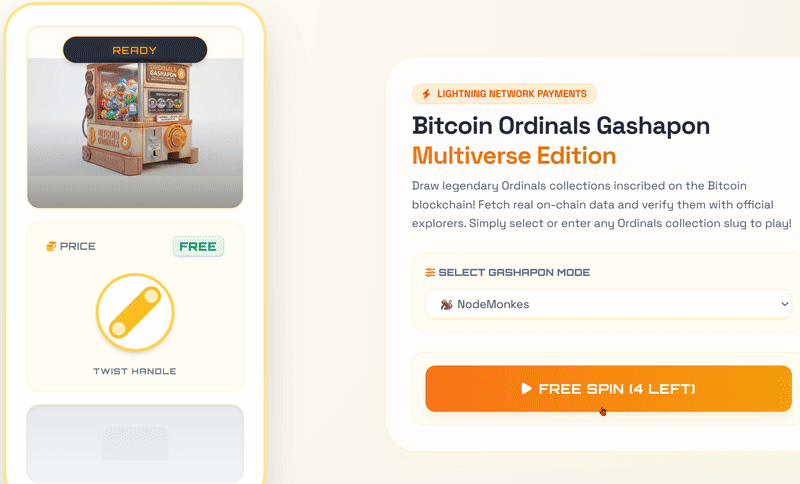
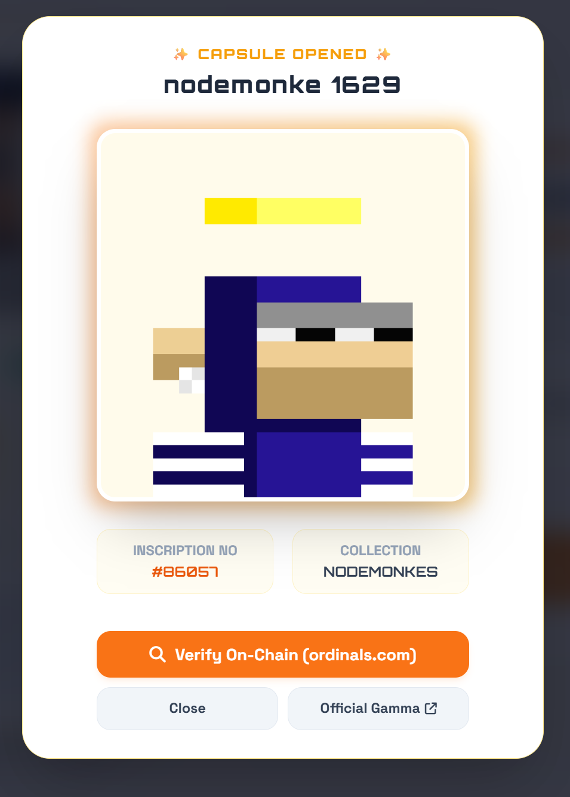

# 🎰 Bitcoin Ordinals Gashapon - Multiverse Edition 🪐

[🇯🇵 日本語のREADMEはこちら (Click here for the Japanese version)](./README_ja.md)

Welcome to the **Bitcoin Ordinals Gashapon**! 
Draw legendary art and digital artifacts inscribed on the Bitcoin blockchain in a traditional, exciting Japanese "Gashapon" style! ⚡️

🌐 **Play Now:** [Insert your Live Demo URL here]

---

## 🇯🇵 What is a "Gashapon"?
In Japan, "Gashapon" (or Gachapon) refers to iconic vending machines that dispense capsule toys when you insert a coin and twist the crank. The thrill of not knowing what you'll get and the pure excitement of popping open the capsule is a fantastic part of Japanese pop culture! 🎁✨ 
This project brings that real-life excitement directly into the digital world of Bitcoin!

## 💎 Why Bitcoin Ordinals?
Ordinals are not just links to images on IPFS or external servers. By inscribing data directly onto individual Satoshis (the smallest unit of Bitcoin), they become **"true digital artifacts permanently stored on the Bitcoin blockchain."**
Even if a server goes down or a company disappears, as long as Bitcoin exists, the art you draw will live on-chain forever. 📜🔒

## ✨ Features
* **🎯 Pure Excitement:** Draw a random on-chain artifact from famous collections or your personal favorites!
* **🎁 5 Completely FREE Spins:** No wallet required to start! Enjoy your first 5 spins on the house to feel the Gashapon experience.
* **💸 Pay-What-You-Want (Lightning Network):** After your free spins, you can freely set your payment amount (300 to 10,000 sats) using the slider. Lightning Network enables ultra-fast, cheap micro-transactions!
* **🧩 Custom Collections:** Enter any valid collection slug (e.g., from Magic Eden or Gamma) to fill the Gashapon with the collection you love.
* **🔍 Instant On-Chain Verification:** Verify the authenticity of your drawn artifact instantly via `ordinals.com` or `Gamma.io`.

---

## 🎮 How to Play

1. **Select a Collection 📦**
   * Choose a popular collection (like NodeMonkes, Bitcoin Puppets, etc.) from the dropdown, or select "Chaos Multiverse" for a completely random draw.
   * You can also select "Custom Slug" and type in a specific collection name.
2. **Twist the Handle 🔄**
   * For your first 5 tries, simply click the "FREE SPIN" button!
   * From the 6th spin onwards, set your desired amount of sats, pay the Lightning Invoice with your wallet, and twist the handle.
3. **Open the Capsule ✨**
   * Tap the dispensed capsule! Watch the cute loading animation as it fetches the real data from the blockchain.
   * Boom! Your on-chain artifact pops out with confetti! 🎉
4. **Verify On-Chain 🔍**
   * Click "Verify On-Chain" to see the permanent inscription data directly on the Bitcoin blockchain.

---

## 🛠 Tech Stack
* **Frontend:** HTML5, Tailwind CSS, Vanilla JavaScript
* **Payments:** [LNbits](https://lnbits.com/) (Lightning Network API)
* **Data Fetching:** Ordinals Wallet API / Ordinals.com / Gamma.io
* **Animations:** Canvas Confetti, CSS Keyframes

---

## 🤝 Related Project
* 🔗 [Tesseract Mempool](https://ck121212195.github.io/tesseract-mempool/) - Check out this cool project to visualize the Bitcoin mempool!

---

## ⚡️ Support & Donate
If you enjoyed the Gashapon experience, feel free to support the developer via Lightning Network! ☕️🐸

**Lightning Address:** `brashridge65@walletofsatoshi.com`

---
*Disclaimer: This is an entertainment application. You are paying SATS for the "experience" of randomly viewing a digital artifact already inscribed on the Bitcoin blockchain. You do not receive ownership of the actual NFT/Inscription by playing this Gashapon.*
